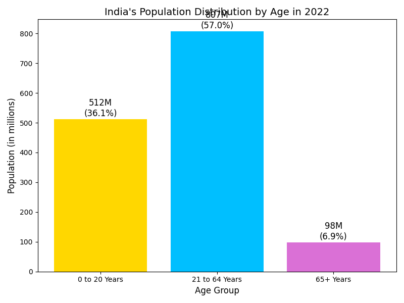

# Task 01 – Data Visualization with Bar Chart

This project contains a simple bar chart that shows time spent on different data science tasks.

## 📊 Chart Output

## 📂 Files

- chart.py: Python script to generate the bar chart
- age_distribution_chart.png: Output image file (auto-generated)
